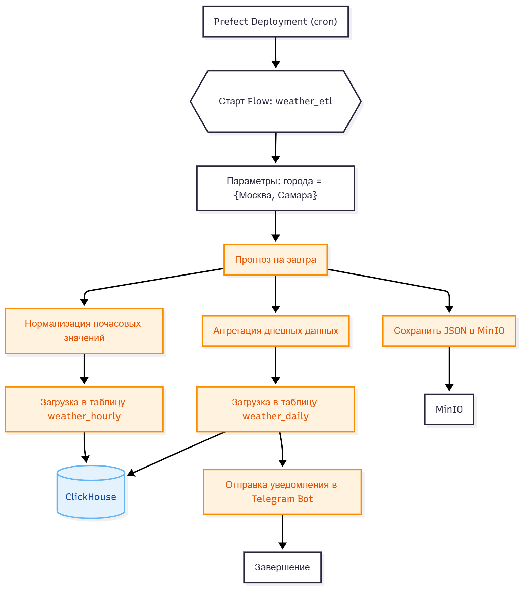
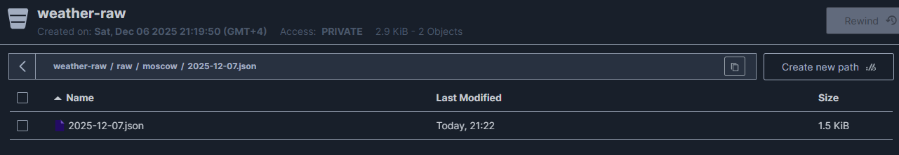
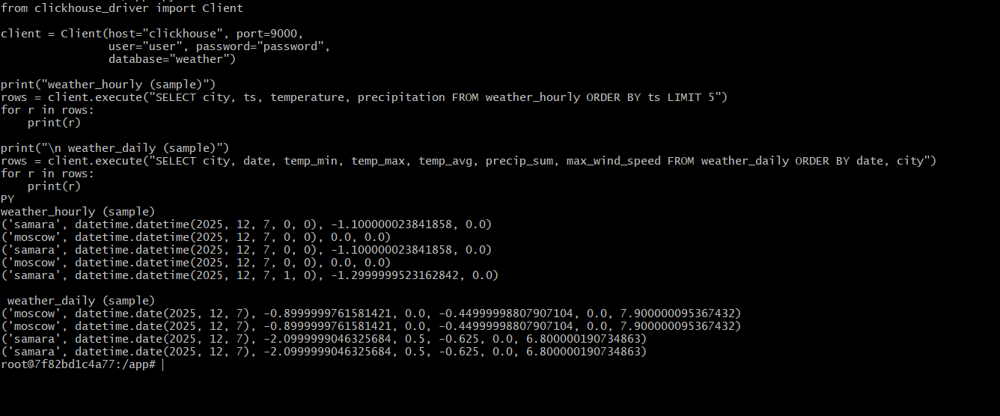

# Лабораторная работа №1 
# Построение ETL-пайплайна на Prefect: 


# 1. Архитектура решения

Цель работы — реализовать полноценный ETL-пайплайн для ежедневного прогноза погоды на завтра для городов **Москва** и **Самара**, включающий:

- извлечение данных из Open-Meteo;
- сохранение сырых данных в MinIO;
- преобразование почасовых и дневных значений;
- загрузку нормализованных данных в ClickHouse;
- отправку итогового уведомления в Telegram.

Общая схема пайплайна:

<p align="center">
  
</p>

**Используемые инструменты:**

- **Prefect 3.x** — оркестрация задач и управление пайплайном  
- **Open-Meteo API** — источник метеоданных  
- **MinIO** — объектное S3-хранилище для сохранения JSON  
- **ClickHouse** — аналитическая СУБД для хранения таблиц  
- **Docker Compose** — единый запуск инфраструктуры  
- **Telegram Bot API** — отправка итогового прогноза пользователю  

# 2. Источник данных

Используется публичный API Open-Meteo: https://api.open-meteo.com/v1/forecast


Основные параметры запроса:

- `latitude`, `longitude` — координаты города  
- `hourly=temperature_2m,precipitation,wind_speed_10m,wind_direction_10m`  
- `timezone=auto`  
- `forecast_days=2` — используется только **завтрашний день**

Пример запроса для Москвы: https://api.open-meteo.com/v1/forecast?latitude=55.75&longitude=37.62&hourly=temperature_2m,precipitation,wind_speed_10m,wind_direction_10m&timezone=auto&forecast_days=2

# 3. Extract → Transform → Load

### 3.1. Extract

Для каждого города выполняется:

- запрос прогноза на завтра;
- сохранение полученного JSON в MinIO по пути: s3://weather-raw/raw/<city>/<YYYY-MM-DD>.json

### 3.2. Transform

Преобразование включает два этапа.

#### a) Нормализация почасовых значений → таблица `weather_hourly`

Данные включают:

- название и ключ города;  
- timestamp;  
- температуру, осадки, скорость и направление ветра.

#### b) Агрегация дневных значений → таблица `weather_daily`

Рассчитываются:

- минимальная, максимальная и средняя температура;  
- суммарные осадки;  
- максимальная скорость ветра;  
- флаги:
  - `strong_wind` — скорость ветра > 15 м/с  
  - `heavy_precip` — осадки > 10 мм  

### 3.3. Load

Создаются две таблицы ClickHouse.

#### **Таблица `weather_hourly`:**

```sql
city String,
city_name String,
ts DateTime,
temperature Float32,
precipitation Float32,
wind_speed Float32,
wind_direction Float32,
date Date
```

#### **Таблица `weather_daily`:**

```sql
city String,
city_name String,
date Date,
temp_min Float32,
temp_max Float32,
temp_avg Float32,
precip_sum Float32,
max_wind_speed Float32,
strong_wind UInt8,
heavy_precip UInt8
```

Загрузка выполняется через библиотеку clickhouse-driver.

# 4. Пайплайн Prefect

Flow состоит из четырёх задач:

extract_task --> transform_task --> load_task --> notify_task

Каждая задача завершается статусом Completed(). 

# 5. Качество данных и обработка ошибок

Реализованы проверки:

 - отсутствие сырого JSON → пропуск города;

 - проверка наличия всех полей API;

 - согласованность длины почасовых массивов;

 - автоматическое создание бакета MinIO при ошибке NoSuchBucket;

 - обработка сетевых ошибок (requests.exceptions);

 - проверка токена Telegram перед отправкой сообщения.

Потенциальные точки сбоя:

 - недоступность Open-Meteo;

 - неверные учётные данные Telegram;

 - проблемы записи в ClickHouse;

 - изменение структуры API.

# 6. Результаты работы

### 6.1 Содержимое MinIO


### 6.2 Данные в ClickHouse


### 6.3. Telegram-уведомление


# 7. Выводы

В ходе работы был реализован полный ETL-конвейер:

 - получение прогноза погоды из API;

 - сохранение сырых данных в объектном хранилище;

 - нормализация почасовых значений;

 - вычисление дневной статистики;

 - загрузка данных в ClickHouse;

 - отправка уведомления пользователю;

 - оркестрация процессов средствами Prefect.

Сложности возникли с корректным преобразованием временных меток и интеграцией ClickHouse.
В качестве возможных улучшений можно выделить:

 - автоматический деплой Prefect (Work Pool + Schedule),

 - подключение мониторинга (Grafana + ClickHouse),

 - расширение набора метеопоказателей,

 - уведомления о погодных аномалиях.

Работа полностью соответствует требованиям задания.